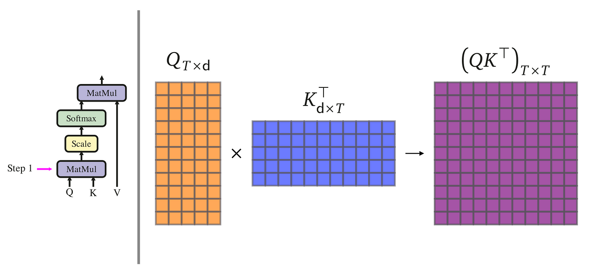
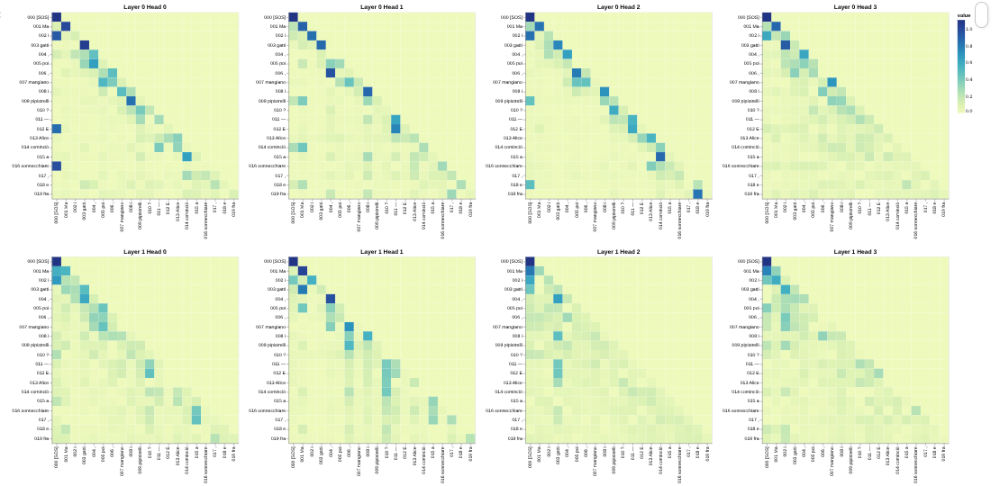

# Attention From Zero – PyTorch Implementation of “Attention Is All You Need”


This project implements the **Transformer architecture from scratch in PyTorch** for bilingual neural machine translation.

This implementation follows the original paper:
**Attention Is All You Need** – Vaswani et al., 2017
[https://arxiv.org/abs/1706.03762](https://arxiv.org/abs/1706.03762)

Instead of relying on high-level libraries like Hugging Face Transformers, every architectural component is implemented manually to demonstrate a deep understanding of attention mechanisms, masking, and sequence modeling.

---

## Project Objective

Modern NLP systems are built on Transformers, yet many engineers interact with them only through APIs.

This project was built to:

* Implement the full encoder–decoder Transformer architecture from first principles
* Understand the mathematics behind scaled dot-product attention
* Engineer a complete training and evaluation pipeline
* Implement masking logic correctly across multi-head attention
* Train and evaluate a bilingual neural machine translation model end-to-end

This is not a wrapper around an existing model — the attention blocks, encoder, decoder, and decoding logic are implemented manually.

---

## Architecture Overview

The implementation follows the original paper design.

### Core Components

* Token Embeddings
* Sinusoidal Positional Encoding
* Multi-Head Self-Attention
* Encoder–Decoder Cross-Attention
* Feed Forward Networks
* Residual Connections + Layer Normalization
* Output Projection Layer
* Greedy Decoding for inference

---

### Scaled Dot-Product Attention



$$\text{Attention}(Q, K, V) = \text{softmax}\left(\frac{QK^T}{\sqrt{d_k}}\right)V$$

Multi-head attention enables the model to attend to different representation subspaces simultaneously.

---

### Encoder Block

Each encoder layer consists of:

1. Multi-head self-attention
2. Feed-forward network
3. Residual connection
4. Layer normalization

---

### Decoder Block

Each decoder layer consists of:

1. Masked self-attention (causal mask)
2. Cross-attention over encoder output
3. Feed-forward network
4. Residual connections
5. Layer normalization

Causal masking ensures the decoder cannot attend to future tokens during training.

---

## Dataset & Training Pipeline

* Dataset: **OPUS Books (English → Italian)**
* Custom WordLevel tokenizer trained on dataset vocabulary
* Special tokens: `[UNK]`, `[PAD]`, `[SOS]`, `[EOS]`
* Teacher forcing during training
* Cross-entropy loss with label smoothing
* Xavier initialization
* Adam optimizer
* Model checkpoint saved after every epoch

Evaluation metrics are tracked using `torchmetrics`:

* BLEU Score
* Word Error Rate (WER)
* Character Error Rate (CER)

---

## Interpretability

An additional notebook (`attention_visual.ipynb`) visualizes attention weights using interactive heatmaps.

This allows inspection of which source tokens the model attends to while generating each target token.

This improves interpretability and demonstrates internal attention dynamics rather than treating the model as a black box.


---

## Project Structure

```
.
├── model.py                  # Transformer architecture implementation
├── dataset.py                # Dataset handling, masking, token preparation
├── train.py                  # Training loop, validation, checkpointing
├── config.py                 # Hyperparameter configuration
├── translate.py              # Inference script with greedy decoding
├── attention_visual.ipynb    # Attention heatmap visualization
└── assets/                   # Images used in documentation
```

---

## How to Run

### Clone Repository

```bash
git clone https://github.com/HmadAfzal/Transformer-From-Scratch
cd Transformer-From-Scratch
```

### Install Dependencies

```bash
pip install -r requirements.txt
```

### Train the Model

```bash
python train.py
```

### Run Inference

```bash
python translate.py "Building a transformer from scratch is challenging but rewarding."
```

---

## References

Vaswani, A. et al. (2017).
**Attention Is All You Need**
[https://arxiv.org/abs/1706.03762](https://arxiv.org/abs/1706.03762)

---